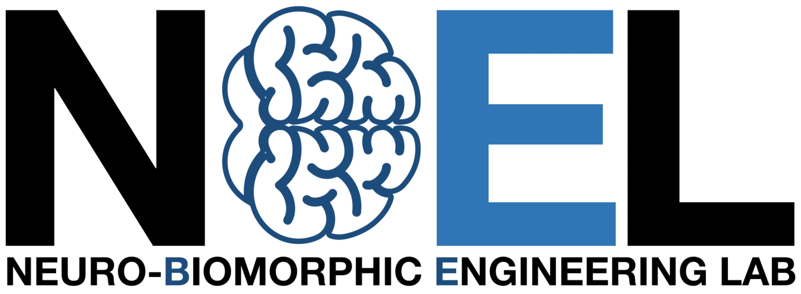

# Sim2E
We introduce our Mujoco based, Interbotix vx300s digital twin with six degrees of freedom (DOF) robotic arm, mounted with a virtual event camera. The robotic arm 3D model is in a configurable virtual lab, rendered in the Unity3D game engine, and the events are generated using the Esim event camera simulator. The system can generate, and record simulated neuromorphic vision data while the robot arm is in motion. 

This project utilizes Esim to generate events from a sequence of images.
You can find a pdf of the paper [here](http://rpg.ifi.uzh.ch/docs/CORL18_Rebecq.pdf). If you use any of this code, please cite this publication.

```bibtex
@Article{Rebecq18corl,
  author        = {Henri Rebecq and Daniel Gehrig and Davide Scaramuzza},
  title         = {{ESIM}: an Open Event Camera Simulator},
  journal       = {Conf. on Robotics Learning (CoRL)},
  year          = 2018,
  month         = oct
}
```

## Installation

### Requirements

* Ubuntu 18.04 or newer
* Nvidia GPU with CUDA support
* Nvidia Cudnn 
* Anaconda

#### step 0: Create a conda environment
```bash
conda create -n sim2e python=3.9
conda activate sim2e
```


#### step 1: Install python binding of Esim with GPU support
**IMPORTANT:** Make sure to stay on the sim2e conda environment and don't switch to the environment in the Esim installation guide. <br/>
Instructions can be found in this [github page](https://github.com/uzh-rpg/rpg_vid2e).
#### step 2: Install Mujoco
Install mujoco and mujoco-py. Instructions can be found in this video [here](https://www.youtube.com/watch?v=Wnb_fiStFb8&ab_channel=GuyTordjman) . You can also follow the instructions in this [document](https://docs.google.com/document/d/1eBvfKoczKmImUgoGMbqypODBXmI1bD91/edit) instead.


#### step 3: Clone the repository and install dependencies
```bash
git clone https://github.com/Turgibot/Sim2E.git
cd Sim2E
pip install -r requirements.txt
```

## Usage
Run the following command to start the simulation
```bash
python main.py
```
Certain flags can be used to adjust how the simulation operates.

Run with real robot arm attached
```bash
python main.py -r
```
Enable EE to look at target before motion
```bash
python main.py -l
```
Make EE shake instead of going to target
```bash
python main.py -s
```
Disable extra camera window
```bash
python main.py -dc
```
Change output folder for npz files
```bash
python -o your_folder_name
```
Additional arguments
```bash
python main.py --help
```


